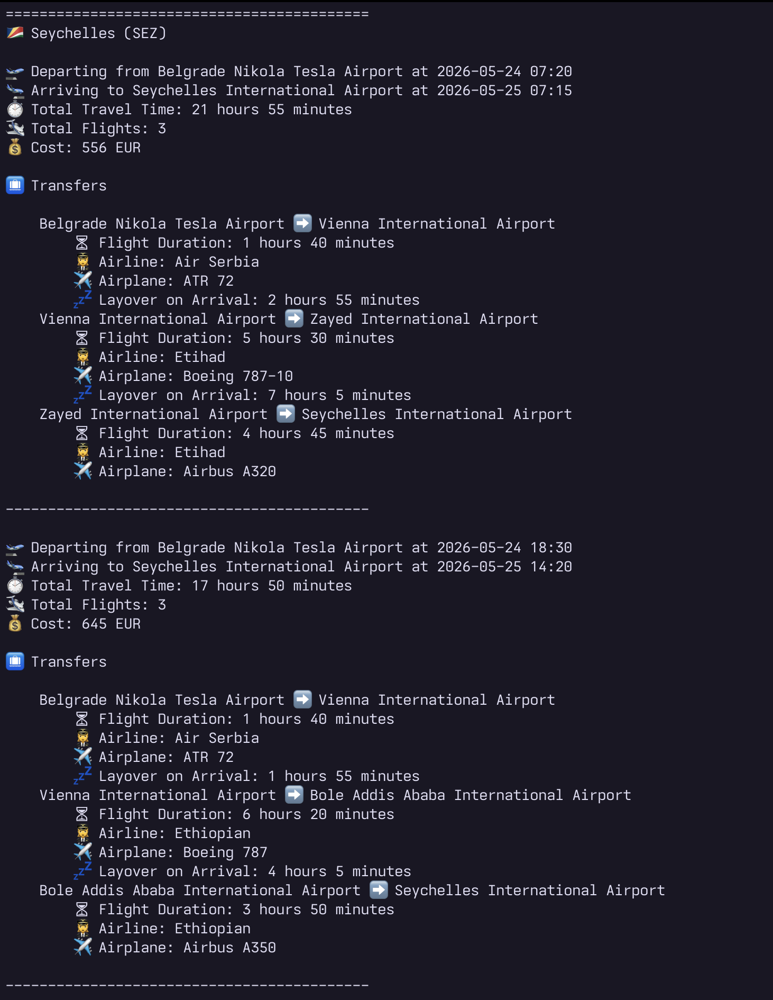

# Flight CLI
*A small Go project that was primarily created as a practice for using and parsing complex nested third party APIs*



## Data Sources

The project relies on Google Flights data as provided by SERPAPI's wrapper. Thre free account alows for 250 montly searches which is more than enough for testing the basic functionalities and using the app for private use.

While SERPIAPI has a dedicated Go library handling the abstraction, in the scope of this project, a basic implementation of standard library's `net/http` will be used instead — again with the main purpose of learning the basics.

## Handling the API Key

The API key required for accessing SERPAPI's data will be stored in the `.env` file. Users of the app will need to register independently and store their own API in this file under the key of `API_KEY`.

The library `github.com/joho/godotenv` is used for reading the environment variables from the file.

## Origin Airport and Currency

The origin airport's IATA code is defined in the `.env` file under the key of `ORIGIN_CODE`. Similarly, the display currency is also provided in the `.env` under the key of currency. So, as an example, your `.env` file would look like this:
```
API_KEY=xxx
ORIGIN_CODE=ADD
CURRENCY=EUR
```

## Destination flights

The `destinations.json` file contains a list of target destinations as well as the rules for their display in a nice and structured way. While much of this data could be further obtained using more third party APIs, that is outside of the scope of this project. As such, the structure presented there is final and the app is functioning expecting it not to change.

## Display

The display of the values is determined by the `internal/utils/display_response.go` file, while the parsing of the response from the API is determined by structs found in `internal/utils/response_parser.go`.

At this point, the following information is displayed:
* Initial Departure Time
* Final Arrival Time
* Total Travel Time
* Total Number of Flights
* Total Cost

Furthermore, for the flights with multiple transfers, extra information is provided for each flight:
* Flight duration
* Airline
* Airplane
* Layover Time